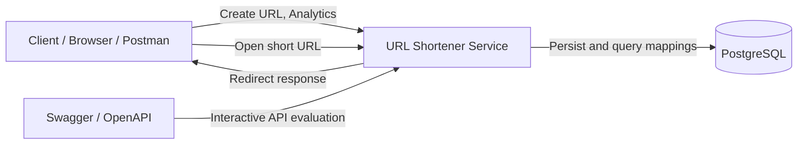
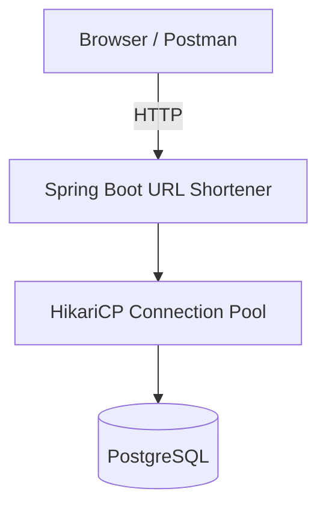
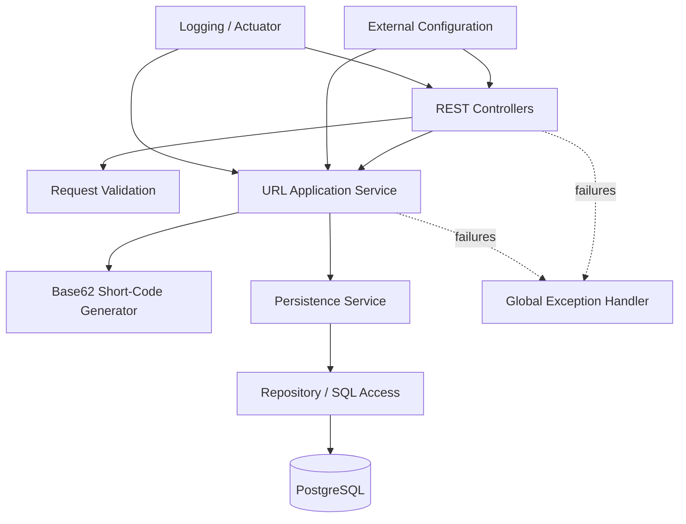
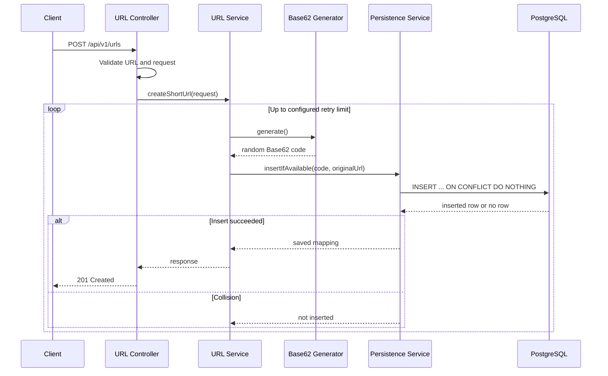
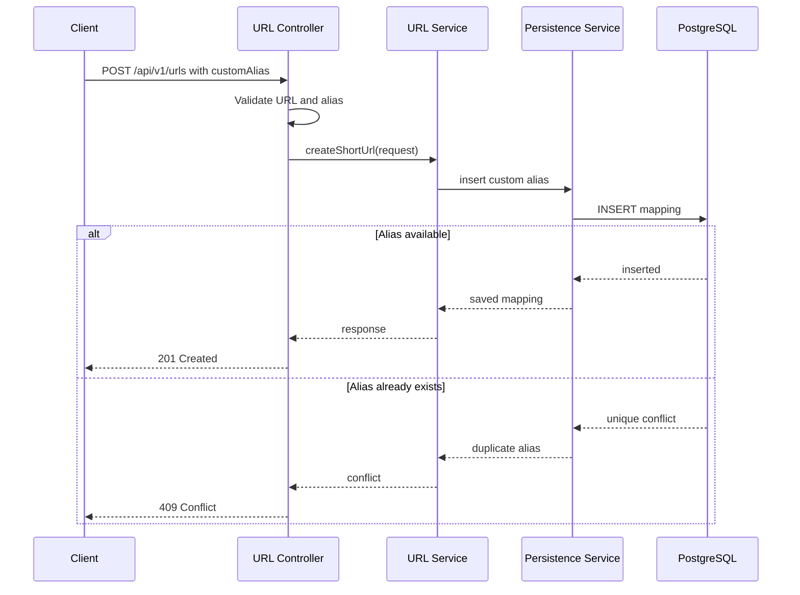
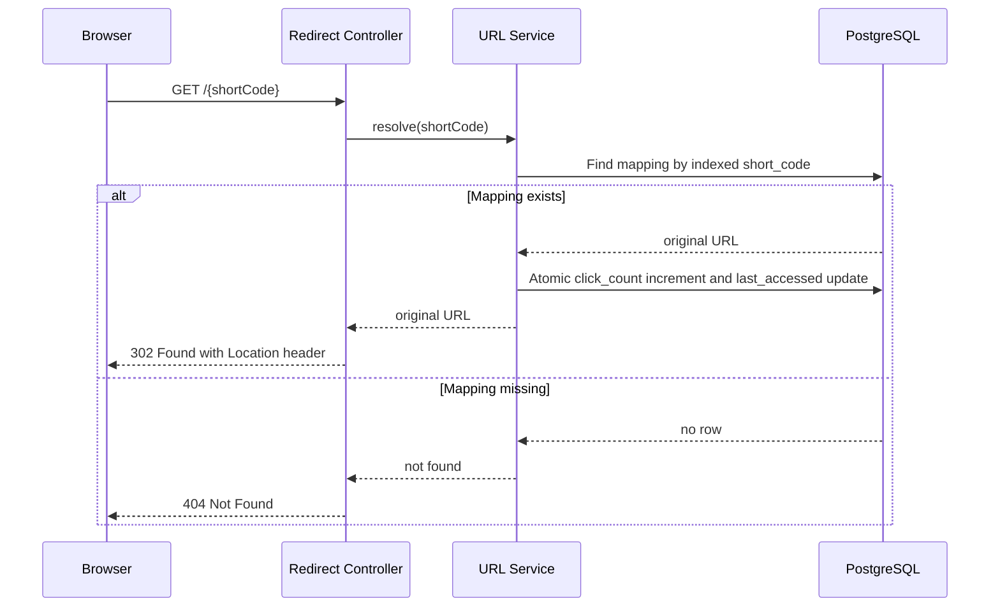
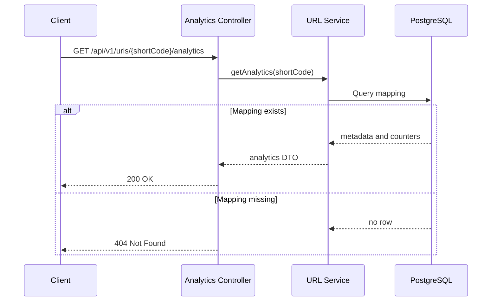
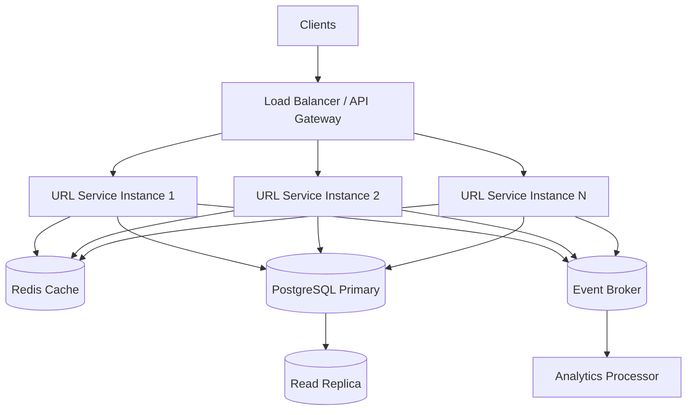

# High-Level Architecture

## Project

AI-Assisted Production-Grade URL Shortener

## 1. Architecture Goal

The goal is to deliver a runnable, reviewable backend prototype that implements the URL-shortening flow end to end while remaining:

- modular;
- testable;
- concurrency-safe;
- environment-independent;
- horizontally scalable at the application layer;
- easy to extend for higher traffic and operational maturity.

The submitted implementation intentionally uses the simplest architecture that satisfies the current requirements. Large-scale components such as Redis, Kafka, distributed rate limiting, and multi-region data storage are documented as future evolution rather than added prematurely.

---

## 2. Architectural Style

### Selected approach: Modular monolith

The prototype will be implemented as one Spring Boot application with clearly separated modules/packages:

- API/controller layer;
- application/service layer;
- domain and validation logic;
- persistence/repository layer;
- configuration;
- exception handling;
- observability.

### Why not microservices for the prototype?

The current business scope is cohesive and small. Splitting URL creation, redirection, and analytics into separate deployable services would introduce:

- network calls;
- distributed transactions;
- additional deployment and monitoring overhead;
- more failure modes;
- more documentation and setup burden.

A modular monolith provides clean boundaries without unnecessary distributed-system complexity. If traffic or organizational ownership later justifies separation, the modules can evolve into independent services.

---

## 3. System Context



---

## 4. Prototype Deployment Architecture



### Deployment assumptions

- One Spring Boot process for local evaluation.
- One PostgreSQL database.
- No server-side session state.
- Base URL and database settings externalized.
- The same application can later run as multiple instances without changing business logic.

---

## 5. Logical Components



### 5.1 Controller layer

Responsibilities:

- expose REST endpoints;
- deserialize requests;
- trigger Bean Validation;
- return HTTP status codes and response DTOs;
- issue HTTP redirect responses;
- avoid containing business logic.

### 5.2 Application/service layer

Responsibilities:

- coordinate URL creation;
- distinguish custom-alias and generated-code flows;
- apply business rules;
- retrieve mappings;
- coordinate analytics;
- construct response data;
- remain independent of HTTP details where practical.

### 5.3 Short-code generator

Responsibilities:

- generate a 10-character Base62 value;
- use `SecureRandom`;
- remain stateless and independently testable;
- make collisions extremely unlikely without claiming uniqueness by itself.

### 5.4 Persistence layer

Responsibilities:

- persist URL mappings;
- enforce database-backed uniqueness;
- perform atomic insert behavior;
- retrieve mappings by short code;
- perform atomic analytics increments;
- isolate database-specific operations from higher layers.

### 5.5 PostgreSQL

Responsibilities:

- system of record for URL mappings;
- unique constraint on `short_code`;
- indexed lookup for redirects;
- transactional writes;
- atomic analytics updates.

### 5.6 Global exception handling

Responsibilities:

- convert validation and business failures into stable JSON error responses;
- return `400`, `404`, `409`, `500`, or `503` as appropriate;
- prevent internal stack traces from reaching clients.

### 5.7 Configuration

Responsibilities:

- externalize application base URL;
- externalize database settings;
- expose configurable code length and retry limit where appropriate;
- avoid environment-specific values in source code or the database.

---

## 6. Core Request Flows

## 6.1 Create a short URL with an automatically generated code



### Correctness guarantee

The generator does not guarantee uniqueness. PostgreSQL's unique constraint is the final authority. A collision causes an immediate bounded retry without a deliberate delay.

---

## 6.2 Create a short URL with a custom alias



The application must not silently replace a user-requested alias with a generated value.

---

## 6.3 Redirect short URL



### Redirect status choice

The prototype will use `302 Found` by default. A permanent `301` can be cached aggressively by clients and intermediaries, which may make future destination changes difficult.

---

## 6.4 Retrieve analytics



---

## 7. Data Ownership

PostgreSQL is the authoritative store for:

- short code;
- original URL;
- creation timestamp;
- click count;
- last-accessed timestamp;
- future expiry or status fields, if added.

The application does not store the complete shortened URL because the host and scheme differ across local, test, and production environments. It stores only the short code and constructs the public URL from configured base URL information.

---

## 8. Concurrency Model

### Short-code creation

- Generate code locally.
- Attempt an atomic insert.
- Rely on the database unique constraint.
- Retry an automatically generated collision up to a configured maximum.
- Return `409 Conflict` for a duplicate custom alias.

### Analytics update

The redirect flow must avoid application-level read-modify-write behavior. The database should increment the counter atomically:

```sql
UPDATE url_mapping
SET click_count = click_count + 1,
    last_accessed_at = CURRENT_TIMESTAMP
WHERE short_code = :shortCode;
```

This prevents lost updates under concurrent redirects.

---

## 9. Scaling Evolution

The application layer is designed to remain stateless so that multiple instances can be added later.



### Future additions

- Redis for hot redirect lookups.
- Asynchronous event publication for clicks.
- Separate analytics consumer.
- Read replicas for non-critical queries.
- Partitioning or sharding when data size requires it.
- Rate limiting and abuse controls at the gateway.
- Centralized metrics, tracing, and alerting.
- Multi-region deployment based on business requirements.

These components are not implemented in the prototype because they add operational complexity without being necessary to demonstrate the core engineering outcome.

---

## 10. Technology Choices

| Concern | Choice | Rationale |
|---|---|---|
| Language | Java 21 | LTS, enterprise relevance, modern runtime |
| Framework | Spring Boot 3.x | Mature web, validation, data, testing, and operational ecosystem |
| API style | REST | Simple, evaluator-friendly resource operations |
| Persistence | PostgreSQL | Transactions, constraints, indexing, atomic updates |
| Build | Maven | Reproducible enterprise-standard build |
| API documentation | OpenAPI / Swagger | Interactive review and testing |
| Testing | JUnit 5, Mockito, Spring tests | Unit and integration validation |
| Identifier | Random 10-character Base62 | Compact, opaque, large namespace |
| Uniqueness | Database unique constraint | Safe across threads and application instances |
| Architecture | Modular monolith | Clean boundaries without premature distribution |

---

## 11. Key Architecture Decisions

1. Build one modular Spring Boot service rather than microservices.
2. Keep the service stateless.
3. Store only the short code, not the complete shortened URL.
4. Use random Base62 identifiers with database-enforced uniqueness and bounded retry.
5. Treat custom-alias conflicts differently from generated-code collisions.
6. Use PostgreSQL as the system of record.
7. Use atomic database analytics updates.
8. Use `302 Found` for redirects.
9. Keep cache and asynchronous analytics as documented scale-out options.
10. Avoid claiming a throughput figure without load-test evidence.

---

## 12. Architecture Risks and Controls

| Risk | Control |
|---|---|
| Short-code collision | Large Base62 namespace, unique constraint, bounded retry |
| Concurrent custom-alias requests | Database uniqueness and `409 Conflict` |
| Lost click increments | Atomic SQL update |
| Database outage | Structured error handling and health visibility |
| Invalid or unsafe URL schemes | Allow only HTTP/HTTPS and validate length/format |
| Hard-coded environment URL | Externalized base URL |
| Excess database load during redirects | Indexed lookup now; Redis and async analytics later |
| Overengineering within assignment timeframe | Modular monolith and documented evolution path |
| Blind AI-generated design/code | Human review, tests, decision log, AI usage traceability |

---

## 13. Architecture Validation

The architecture will be validated through:

- successful Maven build;
- unit tests for generator and business rules;
- integration tests against PostgreSQL or a compatible test environment;
- duplicate-alias tests;
- forced generated-code collision tests;
- concurrent analytics increment tests where practical;
- API tests through Swagger or automated integration tests;
- review of configuration portability;
- review of failure and error responses.

---

## 14. Current Scope Boundary

### Included

- URL creation;
- optional custom alias;
- generated code allocation;
- redirect;
- analytics;
- persistence;
- validation;
- error handling;
- logging;
- API documentation;
- automated tests.

### Not included in the submitted prototype

- authentication;
- premium subscriptions;
- distributed cache;
- event broker;
- multi-region deployment;
- full abuse and malicious-domain detection;
- verified internet-scale throughput.

The design leaves explicit extension points for these capabilities without pretending that they are already delivered.
