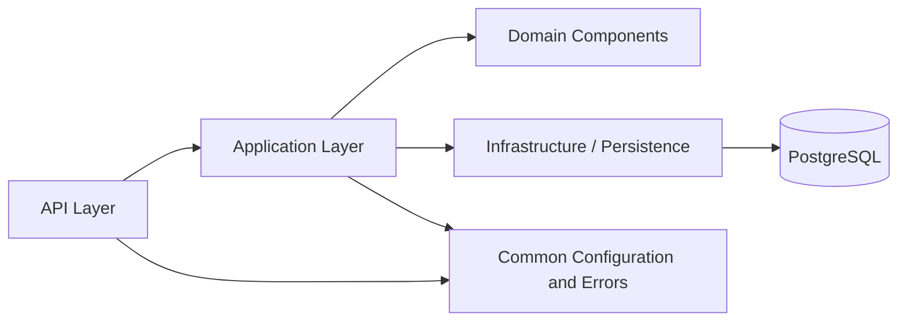
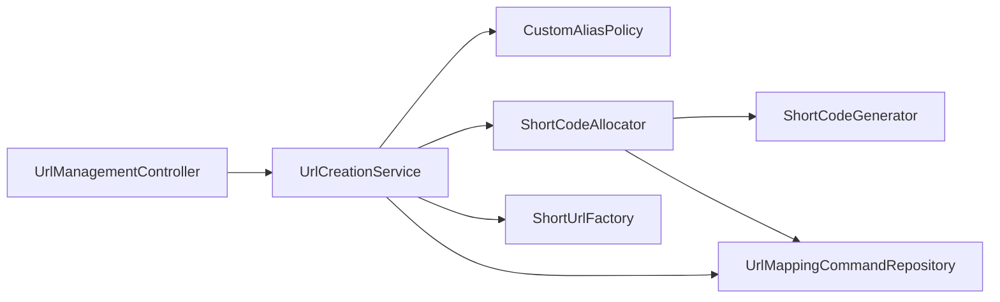
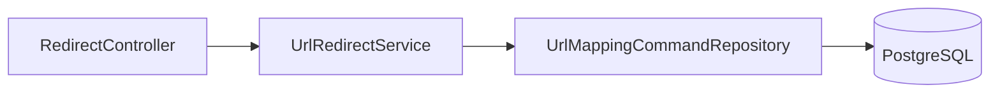
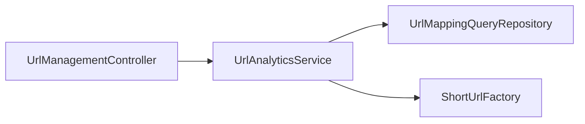

# Package and Class Design

## Project

AI-Assisted Production-Grade URL Shortener

## 1. Purpose

This document defines the Java package structure, major classes, responsibilities, dependency direction, and collaboration model for the URL Shortener prototype.

The design aims to remain:

- simple enough for a 24-hour implementation;
- modular enough to support later growth;
- easy to test;
- explicit about concurrency-sensitive behavior;
- free from controller, persistence, and API-model coupling;
- understandable during code review and interview discussion.

---

## 2. Selected Packaging Strategy

### Feature-first modular structure

The application is organized around the URL-shortening capability, with internal sub-packages for API, application, domain, and persistence concerns.

```text
com.example.urlshortener
├── UrlShortenerApplication
├── common
│   ├── config
│   ├── error
│   └── web
└── url
    ├── api
    ├── application
    ├── domain
    └── infrastructure
```

### Why not only layer-first packages?

A purely layer-first structure such as:

```text
controller/
service/
repository/
entity/
dto/
```

works for small applications, but related URL-shortening code becomes distributed across unrelated top-level folders as the application grows.

The selected feature-first structure keeps one business capability together while preserving clear internal layers.

---

## 3. Proposed Source Tree

```text
src/main/java/com/example/urlshortener/
│
├── UrlShortenerApplication.java
│
├── common/
│   ├── config/
│   │   ├── UrlShortenerProperties.java
│   │   └── OpenApiConfiguration.java
│   │
│   ├── error/
│   │   ├── ApiErrorResponse.java
│   │   ├── FieldViolation.java
│   │   ├── GlobalExceptionHandler.java
│   │   └── ErrorCode.java
│   │
│   └── web/
│       └── CorrelationIdFilter.java
│
└── url/
    ├── api/
    │   ├── UrlManagementController.java
    │   ├── RedirectController.java
    │   └── dto/
    │       ├── CreateUrlRequest.java
    │       ├── CreateUrlResponse.java
    │       └── UrlAnalyticsResponse.java
    │
    ├── application/
    │   ├── UrlCreationService.java
    │   ├── UrlRedirectService.java
    │   ├── UrlAnalyticsService.java
    │   ├── ShortCodeAllocator.java
    │   └── ShortUrlFactory.java
    │
    ├── domain/
    │   ├── UrlMapping.java
    │   ├── ShortCodeGenerator.java
    │   ├── SecureRandomBase62ShortCodeGenerator.java
    │   ├── CustomAliasPolicy.java
    │   ├── ValidHttpUrl.java
    │   └── HttpUrlValidator.java
    │
    └── infrastructure/
        ├── UrlMappingQueryRepository.java
        ├── UrlMappingCommandRepository.java
        ├── PostgresUrlMappingCommandRepository.java
        └── UrlMappingRowMapper.java
```

Test code mirrors the same feature structure under:

```text
src/test/java/com/example/urlshortener/
```

---

## 4. Dependency Direction



### Dependency rules

1. Controllers may call application services.
2. Controllers must not call repositories directly.
3. Application services may use domain components and persistence abstractions.
4. Persistence code must not depend on API DTOs.
5. JPA entities must not be returned directly from controllers.
6. Common error and configuration types may be used by multiple layers.
7. No cyclic dependencies are allowed.

---

# 5. API Layer

## 5.1 `UrlManagementController`

### Responsibility

Expose management APIs:

```http
POST /api/v1/urls
GET /api/v1/urls/{shortCode}/analytics
```

### Dependencies

- `UrlCreationService`
- `UrlAnalyticsService`

### Example method signatures

```java
@PostMapping("/api/v1/urls")
ResponseEntity<CreateUrlResponse> createUrl(
        @Valid @RequestBody CreateUrlRequest request);

@GetMapping("/api/v1/urls/{shortCode}/analytics")
UrlAnalyticsResponse getAnalytics(
        @PathVariable String shortCode);
```

### Design rule

The controller:

- validates transport-level input;
- delegates immediately;
- maps success to HTTP;
- contains no repository access or short-code generation logic.

---

## 5.2 `RedirectController`

### Responsibility

Expose the compact public redirect route:

```http
GET /{shortCode}
```

### Dependency

- `UrlRedirectService`

### Example method signature

```java
@GetMapping("/{shortCode}")
ResponseEntity<Void> redirect(
        @PathVariable String shortCode);
```

The controller creates a response containing:

```http
302 Found
Location: <original URL>
Cache-Control: no-store
```

### Why a separate controller?

Redirect behavior differs from the JSON management API:

- root-level route;
- empty response body;
- redirect-specific headers;
- different operational traffic pattern.

Separating it keeps HTTP behavior clear and avoids a large mixed-purpose controller.

---

# 6. API DTOs

## 6.1 `CreateUrlRequest`

Use a Java record:

```java
public record CreateUrlRequest(
        @NotBlank
        @Size(max = 2048)
        @ValidHttpUrl
        String originalUrl,

        @Pattern(
            regexp = "^[a-z0-9](?:[a-z0-9-]{1,30}[a-z0-9])?$",
            message = "must be 3-32 lowercase letters, digits, or hyphens"
        )
        String customAlias
) {}
```

Blank `customAlias` values should be normalized to absent before business processing.

## 6.2 `CreateUrlResponse`

```java
public record CreateUrlResponse(
        String shortCode,
        URI shortUrl,
        URI originalUrl,
        Instant createdAt
) {}
```

## 6.3 `UrlAnalyticsResponse`

```java
public record UrlAnalyticsResponse(
        String shortCode,
        URI shortUrl,
        URI originalUrl,
        long clickCount,
        Instant createdAt,
        Instant lastAccessedAt
) {}
```

### Why use records?

- immutable by default;
- concise;
- value-oriented;
- ideal for API request and response models;
- reduce boilerplate without requiring Lombok.

---

# 7. Application Layer

## 7.1 `UrlCreationService`

### Responsibility

Coordinate URL creation.

### Dependencies

- `CustomAliasPolicy`
- `ShortCodeAllocator`
- `UrlMappingCommandRepository`
- `ShortUrlFactory`

### High-level behavior

```text
Normalize request
      ↓
Custom alias present?
  ├── Yes → validate policy → atomic insert → conflict becomes 409
  └── No  → ask ShortCodeAllocator to allocate generated code
      ↓
Build response
```

### Important rule

The service owns business-flow decisions but does not implement random generation or SQL directly.

---

## 7.2 `ShortCodeAllocator`

### Responsibility

Allocate an automatically generated short code safely.

### Dependencies

- `ShortCodeGenerator`
- `UrlMappingCommandRepository`
- `UrlShortenerProperties`

### Pseudocode

```java
for (int attempt = 0; attempt < maxAttempts; attempt++) {
    String candidate = generator.generate(codeLength);

    Optional<UrlMapping> inserted =
            commandRepository.insertIfAbsent(candidate, originalUrl);

    if (inserted.isPresent()) {
        return inserted.get();
    }
}

throw new ShortCodeAllocationException();
```

### Why make allocation a separate class?

It isolates:

- retry behavior;
- generator collaboration;
- collision handling;
- retry-limit configuration.

This makes forced-collision testing straightforward and prevents `UrlCreationService` from becoming too large.

---

## 7.3 `UrlRedirectService`

### Responsibility

Resolve a short code and atomically record the click.

### Dependency

- `UrlMappingCommandRepository`

### Behavior

```text
Call incrementAndReturnOriginalUrl(shortCode)
     ↓
URL returned?
  ├── Yes → return destination
  └── No  → throw ShortUrlNotFoundException
```

The service returns a domain value or `URI`; it does not create HTTP response headers.

---

## 7.4 `UrlAnalyticsService`

### Responsibility

Retrieve aggregate analytics for a short code.

### Dependencies

- `UrlMappingQueryRepository`
- `ShortUrlFactory`

### Behavior

- lookup by short code;
- throw not-found exception when absent;
- map internal data to `UrlAnalyticsResponse`.

---

## 7.5 `ShortUrlFactory`

### Responsibility

Construct the public short URL from:

- configured base URL;
- short code.

Example:

```text
https://short.example.com + aB91xK2LmQ
```

Result:

```text
https://short.example.com/aB91xK2LmQ
```

### Why a dedicated class?

It centralizes slash handling, URI construction, and environment-specific base URL behavior. Services should not concatenate URLs manually.

---

# 8. Domain Components

## 8.1 `UrlMapping`

The JPA entity represents one persisted mapping.

### Main fields

```java
Long id;
String shortCode;
String originalUrl;
Instant createdAt;
Instant lastAccessedAt;
long clickCount;
```

### Encapsulation rules

- no public setter for `id`;
- no public setter for creation timestamp;
- no controller serialization;
- creation through a constructor or static factory;
- JPA-required no-argument constructor has protected visibility.

### Why allow the entity in the domain package?

For this focused prototype, a separate domain object and persistence entity would duplicate the same data without adding meaningful behavior. The entity remains internal and is never exposed through the API.

---

## 8.2 `ShortCodeGenerator`

Interface:

```java
public interface ShortCodeGenerator {
    String generate(int length);
}
```

### Why use an interface?

- deterministic test doubles can force collisions;
- generation strategy can change without changing allocation logic;
- separates candidate generation from uniqueness enforcement.

---

## 8.3 `SecureRandomBase62ShortCodeGenerator`

Implementation of `ShortCodeGenerator`.

### Responsibility

- use the Base62 alphabet;
- use `SecureRandom`;
- create a candidate of the configured length;
- remain stateless after construction.

It does not call the database and does not claim uniqueness.

---

## 8.4 `CustomAliasPolicy`

### Responsibility

Apply business validation not represented by simple regex rules:

- normalize blank alias to absent;
- reject reserved aliases;
- enforce lowercase policy;
- optionally centralize future premium-user restrictions.

### Why not put all rules in the DTO?

Syntax belongs in Bean Validation. Business policy such as reserved words or subscription rules belongs in a domain/application component because it may depend on configuration or user context.

---

## 8.5 `@ValidHttpUrl` and `HttpUrlValidator`

A custom Bean Validation annotation validates:

- absolute URI;
- `http` or `https` scheme;
- host present;
- no embedded credentials;
- no control characters.

### Why a custom validator?

`@NotBlank` and `@Size` cannot validate URL semantics. A dedicated validator keeps the controller declarative and makes URL rules reusable and independently testable.

---

# 9. Persistence Layer

## 9.1 `UrlMappingQueryRepository`

Spring Data JPA interface:

```java
public interface UrlMappingQueryRepository
        extends JpaRepository<UrlMapping, Long> {

    Optional<UrlMapping> findByShortCode(String shortCode);
}
```

Used for ordinary indexed reads such as analytics retrieval.

---

## 9.2 `UrlMappingCommandRepository`

Application-facing interface for concurrency-sensitive writes:

```java
public interface UrlMappingCommandRepository {

    Optional<UrlMapping> insertIfAbsent(
            String shortCode,
            String originalUrl);

    Optional<String> incrementClickAndReturnOriginalUrl(
            String shortCode);
}
```

The application layer depends on this interface, not PostgreSQL-specific implementation details.

---

## 9.3 `PostgresUrlMappingCommandRepository`

Implementation using `NamedParameterJdbcTemplate`.

### Operations

1. `INSERT ... ON CONFLICT DO NOTHING RETURNING ...`
2. `UPDATE ... SET click_count = click_count + 1 ... RETURNING original_url`

### Why explicit SQL here?

These operations rely on PostgreSQL atomic semantics and are clearer than modelling them through multiple JPA calls or normal exception-driven control flow.

---

## 9.4 `UrlMappingRowMapper`

Maps returned SQL rows to `UrlMapping`.

Using an explicit row mapper makes column-to-field conversion visible and testable.

---

# 10. Configuration

## 10.1 `UrlShortenerProperties`

Use type-safe configuration:

```java
@ConfigurationProperties(prefix = "url-shortener")
public record UrlShortenerProperties(
        URI baseUrl,
        int generatedCodeLength,
        int maxAllocationAttempts,
        Set<String> reservedAliases
) {}
```

Example configuration:

```yaml
url-shortener:
  base-url: ${PUBLIC_BASE_URL:http://localhost:8080}
  generated-code-length: 10
  max-allocation-attempts: 5
  reserved-aliases:
    - api
    - swagger-ui
    - swagger-ui.html
    - v3
    - actuator
    - error
    - favicon.ico
```

### Why configuration properties rather than scattered `@Value` fields?

- type safety;
- central validation;
- one documented configuration model;
- easier testing;
- less string-based configuration throughout the application.

---

## 10.2 `OpenApiConfiguration`

Provides API title, description, version, and common error documentation where useful.

This class should remain small; endpoint-specific documentation belongs near the controllers and DTOs.

---

# 11. Error Handling

## 11.1 Domain/application exceptions

Expected exceptions:

```text
ShortUrlNotFoundException
CustomAliasAlreadyExistsException
ReservedCustomAliasException
ShortCodeAllocationException
```

These exceptions represent meaningful application outcomes.

## 11.2 `ErrorCode`

An enum defines stable application codes:

```text
VALIDATION_FAILED
INVALID_URL
INVALID_CUSTOM_ALIAS
RESERVED_CUSTOM_ALIAS
SHORT_URL_NOT_FOUND
CUSTOM_ALIAS_ALREADY_EXISTS
SHORT_CODE_ALLOCATION_FAILED
DEPENDENCY_UNAVAILABLE
INTERNAL_ERROR
```

## 11.3 `GlobalExceptionHandler`

A `@RestControllerAdvice` maps:

- Bean Validation errors → `400`;
- malformed JSON → `400`;
- not found → `404`;
- custom alias conflict → `409`;
- allocation/dependency failure → `503`;
- unexpected error → `500`.

It logs internal details while returning a controlled response without stack traces.

---

# 12. Correlation ID

## `CorrelationIdFilter`

A `OncePerRequestFilter`:

1. reads optional `X-Correlation-ID`;
2. creates a UUID when absent;
3. places it in the logging MDC;
4. adds it to the response header;
5. removes it from MDC in a `finally` block.

This class is optional if time is constrained, but the package design reserves a clean location for it.

---

# 13. Class Collaboration Diagrams

## 13.1 URL creation



Custom alias path:

```text
Controller → Creation Service → Alias Policy
                              → Command Repository
                              → Short URL Factory
```

Generated path:

```text
Controller → Creation Service → Short Code Allocator
                              → Generator
                              → Command Repository
                              → Short URL Factory
```

---

## 13.2 Redirect



---

## 13.3 Analytics



---

# 14. Testing by Class

| Class | Main Tests |
|---|---|
| `HttpUrlValidator` | valid HTTP/HTTPS, relative URL, unsafe scheme, missing host, embedded credentials |
| `CustomAliasPolicy` | reserved words, case behavior, blank normalization |
| `SecureRandomBase62ShortCodeGenerator` | length and alphabet |
| `ShortCodeAllocator` | first-attempt success, collision then success, retry exhaustion |
| `UrlCreationService` | generated path, custom path, duplicate alias |
| `UrlRedirectService` | existing code, missing code |
| `UrlAnalyticsService` | existing analytics, missing code |
| `PostgresUrlMappingCommandRepository` | atomic insert, conflict, atomic click increment |
| `UrlManagementController` | validation, 201, 200 analytics, error mapping |
| `RedirectController` | 302, `Location`, `Cache-Control`, 404 |
| `GlobalExceptionHandler` | stable error codes and response shape |
| `ShortUrlFactory` | base URL with and without trailing slash |

---

# 15. Deliberately Avoided Design Choices

## 15.1 No Lombok

Records remove DTO boilerplate, and explicit constructors keep entity and service dependencies visible.

Avoiding Lombok:

- removes an additional IDE/plugin dependency;
- makes generated code easier for the evaluator to read;
- avoids hidden generated methods.

## 15.2 No generic `BaseService` or `BaseRepository`

Generic inheritance would add abstraction without reuse. Classes remain focused on the URL-shortening capability.

## 15.3 No mapper framework

MapStruct is useful in larger applications, but the prototype has only a few small DTO mappings. Manual mapping is clearer and avoids another build dependency.

## 15.4 No service interface for every service

Interfaces are introduced where multiple implementations or test substitution are valuable, such as `ShortCodeGenerator` and `UrlMappingCommandRepository`.

Creating `UrlCreationService` plus `UrlCreationServiceImpl` with only one implementation would add ceremony without benefit.

## 15.5 No separate domain model and JPA entity

The current entity is simple and internal. Duplicating it into a separate pure domain object would add mapping code without meaningful domain behavior. This can be revisited if the domain becomes richer.

---

# 16. Definition of Done for the Class Design

The package/class design is complete when:

- each class has one clear responsibility;
- controller-to-repository shortcuts are absent;
- DTOs and entities are separated;
- concurrency-sensitive SQL is behind a repository interface;
- generated-code retry logic is independently testable;
- configuration is type-safe and externalized;
- expected exceptions have stable API mappings;
- package dependencies remain acyclic;
- every class can be explained and defended.
